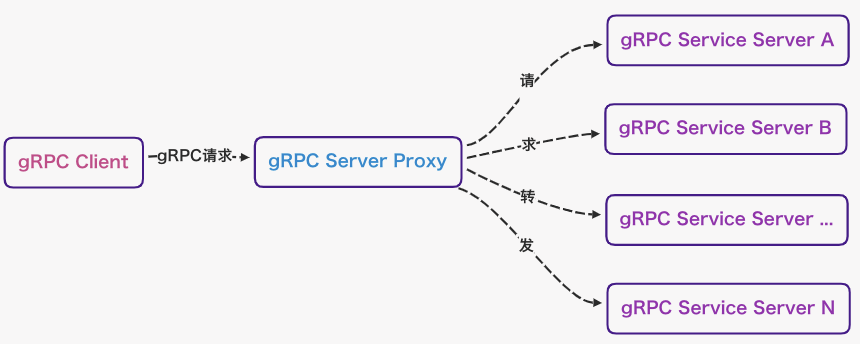
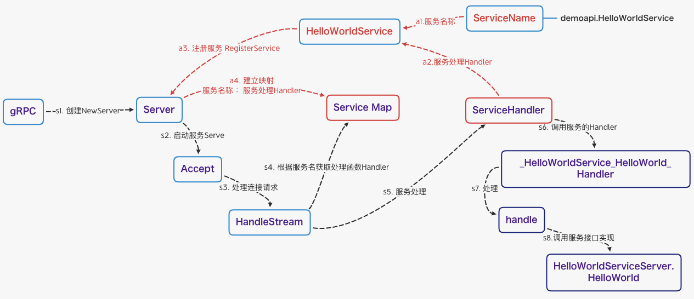
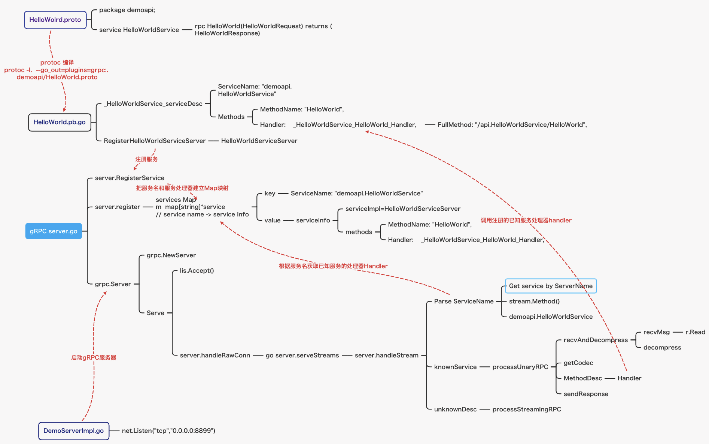
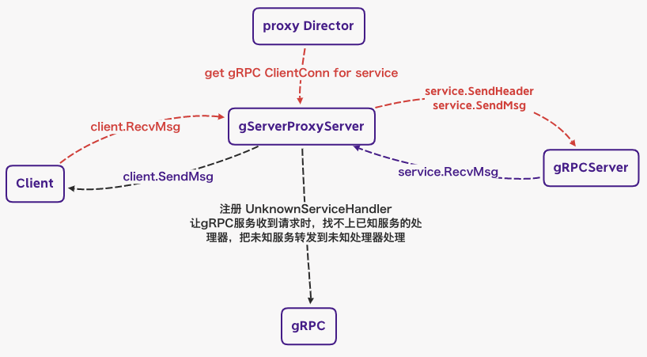

## gRPC Proxy

文章原文：**[【Go】Golang实现gRPC的Proxy的原理](https://www.cnblogs.com/voipman/p/15352001.html)**

### 原理

基本原理如下

* 基于TCP启动一个gRPC代理服务端
* 拦截gRPC框架的服务，能将gRPC请求的服务拦截到转发代理的一个函数中执行
* 接收客户端的请求，处理业务指标后转发给服务端
* 接收服务端的响应，处理业务指标后转发给客户端

### 简化的gRPC服务处理流程
* 流程：
    * 编写自己的服务实现，例子中以HelloWorld为例。
    * 把自己的服务实现HelloWorldServer注册到gRPC框架中
    * 创建一个TCP的服务端监听
    * 基于TCP监听启动一个gRPC服务
    * gRPC服务接收gRPC客户端的TCP请求
        * grpc框架代码执行handleRawConn方法，将这个网络连接设置打破gRPC的传输层，做为网络的读和写实现
        * 依次调用grpc流的handlerStream方法，用于处理gRPC数据流
    * 解析gRPC的头部信息，找出服务名
    * 根据服务名找到第一步注册的服务和方法实现处理器handler
    * 处理函数执行
    * 返回处理结果

* 整体流程图

* 在gRPC框架代码中的handleStream存在的服务
    * knownService
    * unknownService（实现gRPC服务代码的关键）

### gRPC代理的实现原理
* 实现原理
    * 创建grpc服务时，注册一个未知服务处理器Handler和一个自定义的编码Codec编码和解码，此处使用proto标准的Codec
    * 这个handle给业务方预留一个director的接口，用于代理重定向转发的grpc连接获取，这样proxy就可以通过redirector得到gRPCServer的grpc连接
    * proxy接收gRPC客户端的连接，并使用gRPC的RecvMsg方法，接收客户端的消息请求
    * proxy将接收到的gRPC客户端消息请求，通过SendHeader和SendMsg方法发送给gRPC服务端
    * 同样的方法，RecvMsg接收gRPC服务端的响应消息，使用SendMsg发送给gRPC客户端
    * 至此gRPC代码服务就完成了消息的转发功能，企业的限流，权限等功能可以通过转发的功能进行拦截处理
    

* 代码实现原理图

* 核心代码
    * github.com/mwitkow/grpc-proxy/proxy/handler.go
    * **[proxy-demo](./proxy/)**
