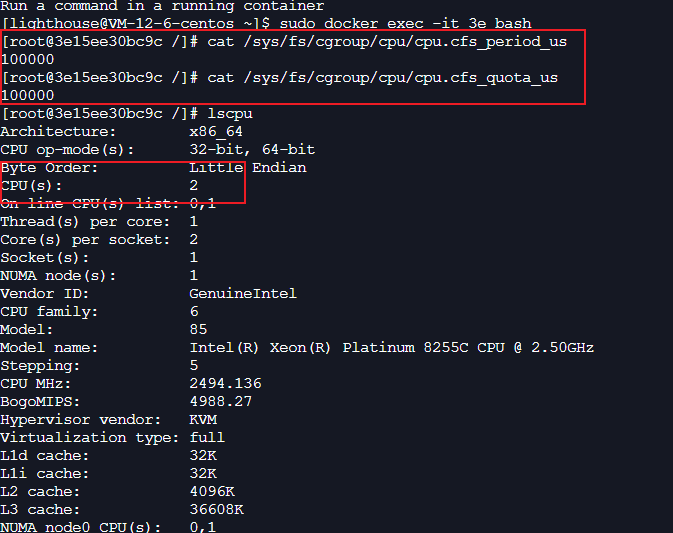

### Automaxprocs 解决了什么问题
一般在部署容器应用时，通常会对 CPU 资源做限制，例如对容器限制了 1 个核。而实际应用的容器中，通过 lscpu 命令 ，我们仍然能看到宿主机的所有 CPU 核。容器技术存在的普遍问题。

这会导致 Golang 服务默认会拿宿主机的 CPU 核心数来调用 runtime.GOMAXPROCS()，导致 P 数量远远大于可用的 CPU 核心，引起频繁上下文切换，影响高负载情况下的服务性能。而 Uber-Automaxprocs 这个库 能够正确识别容器允许使用的核心数，合理的设置 processor 数目，避免高并发下的切换问题

