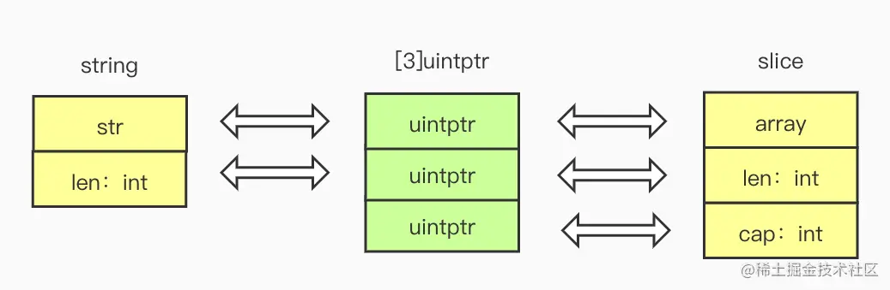

## Go中string与[]byte高效互转


从底层结构上来看string可以看做[2]uintptr，[]byte切片类型可以看做 [3]uintptr

```go
# 切片的实现原理 reflect.SliceHeader
type SliceHeader struct {
	Data uintptr
	Len  int
	Cap  int
}

# 字符串的实现原理 reflect.StringHeader
type StringHeader struct {
	Data uintptr
	Len  int
}
```




#### 实现代码

```go
func stringTobyteSlice(s string) []byte {
   tmp1 := (*[2]uintptr)(unsafe.Pointer(&s))
   tmp2 := [3]uintptr{tmp1[0], tmp1[1], tmp1[1]}
   return *(*[]byte)(unsafe.Pointer(&tmp2))

}


func byteSliceToString(bytes []byte) string {
   return *(*string)(unsafe.Pointer(&bytes))
}
```

