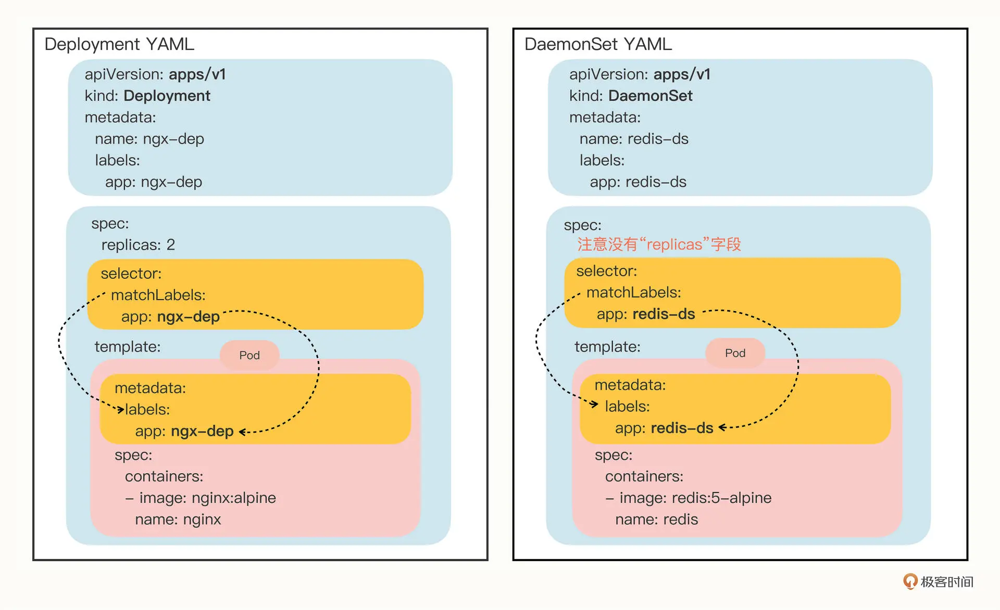

### Daemonset

##### Daemonset 与 Deployment 的关系

DaemonSet 在 spec 里没有 replicas 字段，这是它与 Deployment 的一个关键不同点，意味着它不会在集群里创建多个 Pod 副本，而是要在每个节点上只创建出一个 Pod 实例
DaemonSet 仅仅是在 Pod 的部署调度策略上和 Deployment 不同，其他的都是相同的，某种程度上我们也可以把 DaemonSet 看做是 Deployment 的一个特例

