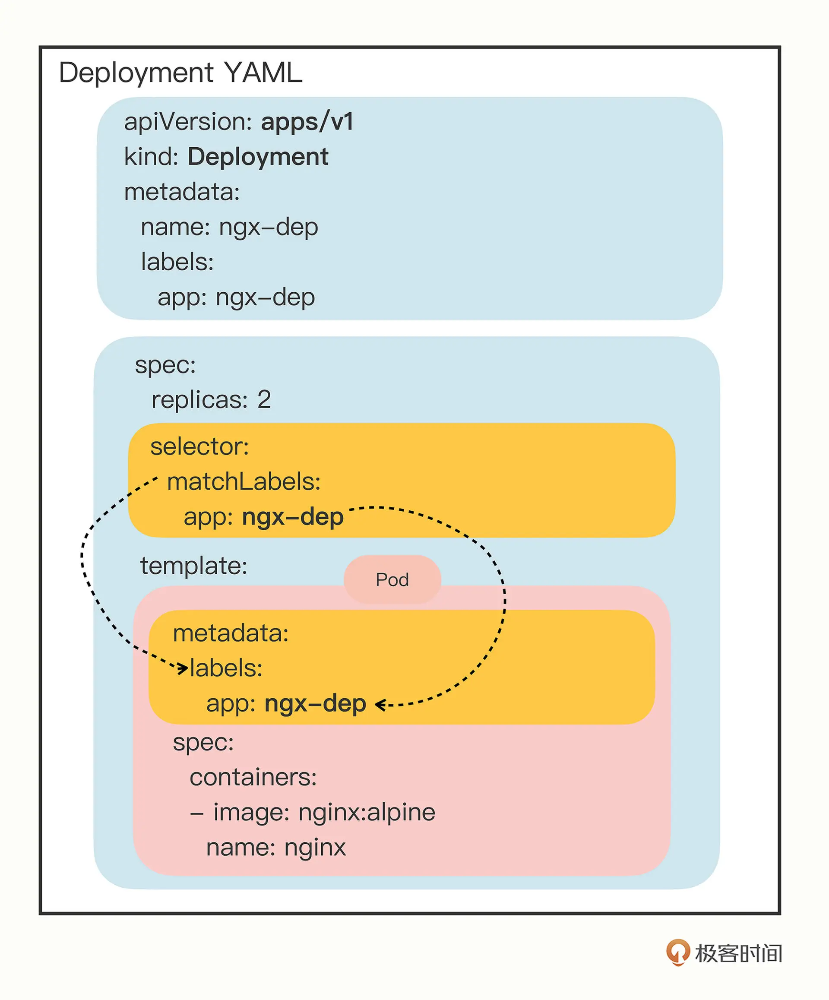
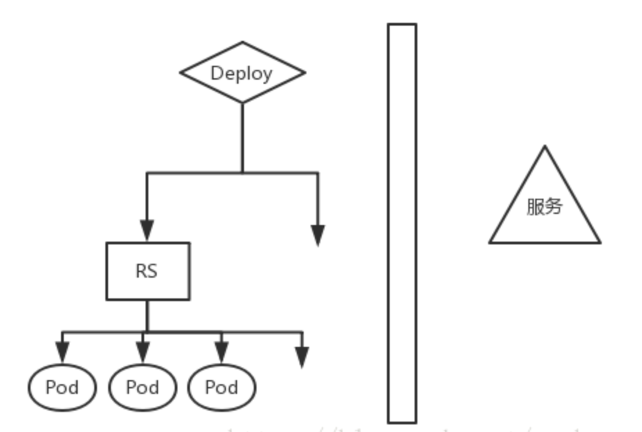

### Deployment

##### Deployment 与 pod 的关系

##### Deployment, ReplicaSet 与 pod 的关系

* ReplicaSet 确保任何时间都有指定数量的 Pod 副本在运行。 然而，Deployment 是一个更高级的概念，它管理 ReplicaSet，并向 Pod 提供声明式的更新以及许多其他有用的功能。 因此，建议使用 Deployment 而不是直接使用 ReplicaSet， 除非你需要自定义更新业务流程或根本不需要更新。