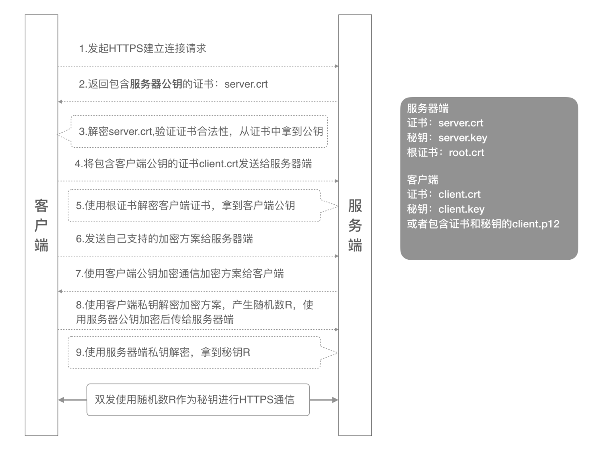

### Kubeconfig

##### 模板

```yml
apiVersion: v1
kind: Config
clusters:
- name: "{{.Cluster}}"
  cluster:
    server: {{.Server}}
    certificate-authority-data: {{.CertificateAuthorityData}}

users:
- name: "{{.User}}"
  user:
    client-certificate-data: {{.ClientCertificateData}}
    client-key-data: {{.ClientKeyData}}
    client-certificate-notAfter: {{.NotAfter}} 

contexts:
- name: {{.User}}@{{.Cluster}}
  context:
    user: "{{.User}}"
    cluster: "{{.Cluster}}"

current-context: {{.User}}@{{.Cluster}}
```


##### 指令

```shell
# 配置指令
kubectl config 

Modify kubeconfig files using subcommands like "kubectl config set current-context my-context"

 The loading order follows these rules:

  1.  If the --kubeconfig flag is set, then only that file is loaded. The flag may only be set once and no merging takes
place.
  2.  If $KUBECONFIG environment variable is set, then it is used as a list of paths (normal path delimiting rules for
your system). These paths are merged. When a value is modified, it is modified in the file that defines the stanza. When
a value is created, it is created in the first file that exists. If no files in the chain exist, then it creates the
last file in the list.
  3.  Otherwise, ${HOME}/.kube/config is used and no merging takes place.

Available Commands:
  current-context   Display the current-context
  delete-cluster    Delete the specified cluster from the kubeconfig
  delete-context    Delete the specified context from the kubeconfig
  delete-user       Delete the specified user from the kubeconfig
  get-clusters      Display clusters defined in the kubeconfig
  get-contexts      Describe one or many contexts
  get-users         Display users defined in the kubeconfig
  rename-context    Rename a context from the kubeconfig file
  set               Set an individual value in a kubeconfig file
  set-cluster       Set a cluster entry in kubeconfig
  set-context       Set a context entry in kubeconfig
  set-credentials   Set a user entry in kubeconfig
  unset             Unset an individual value in a kubeconfig file
  use-context       Set the current-context in a kubeconfig file
  view              Display merged kubeconfig settings or a specified kubeconfig file

Usage:
  kubectl config SUBCOMMAND [options]

Use "kubectl <command> --help" for more information about a given command.
Use "kubectl options" for a list of global command-line options (applies to all commands).
```


##### Contexts

在kubeconfig里可以配置多套kubernetes集群，然后使用kubectl的时候就可以指定使用哪个环境，因此1个context就代表1个kubernetes集群 


##### Users

name 仅仅是一个标识，在 Contexts 中使用，并不代表kubernetes集群中的用户

client-certificate-data:  kubernetes签发的客户端证书（里面记录着真正的用户名）

client-key-data:  后者是客户端私钥


##### Clusters

name仅仅是kubeconfig文件内的集群标识，用在context配置里面。

server指定了apiserver的访问地址

certificate-authority-data:  kubernetes的CA证书自身


###### kubeconfig 字段含义

https://kubernetes.io/docs/reference/config-api/kubeconfig.v1/


##### 双向TLS认证

使用kubeconfig与kube-api-server交互的时候，使用的是双向TLS认证



1. 客户端发起建立HTTPS连接请求，将SSL协议版本的信息发送给服务端；
2. 服务器端将本机的公钥证书（server.crt）发送给客户端；
3. 客户端读取公钥证书（server.crt），取出了服务端公钥；
4. 客户端将客户端公钥证书（client.crt）发送给服务器端；
5. 服务器端使用根证书（root.crt）解密客户端公钥证书，拿到客户端公钥；
6. 客户端发送自己支持的加密方案给服务器端；
7. 服务器端根据自己和客户端的能力，选择一个双方都能接受的加密方案，使用客户端的公钥加密后发送给客户端；
8. 客户端使用自己的私钥解密加密方案，生成一个随机数R，使用服务器公钥加密后传给服务器端；
9. 服务端用自己的私钥去解密这个密文，得到了密钥R
10. 服务端和客户端在后续通讯过程中就使用这个密钥R进行通信了。


##### 为用户签发Kubeconfig - 指定用户权限

为了让普通用户能够通过认证并调用 API，需要执行几个步骤。 首先，该用户必须拥有 Kubernetes 集群签发的证书， 然后将该证书提供给 Kubernetes API。


##### 创建私钥

下面的脚本展示了如何生成 PKI 私钥和 CSR。 设置 CSR 的 CN 和 O 属性很重要。CN 是用户名，O 是该用户归属的组。 你可以参考 [RBAC](https://kubernetes.io/zh-cn/docs/reference/access-authn-authz/rbac/) 了解标准组的信息。

```
openssl genrsa -out myuser.key 2048
openssl req -new -key myuser.key -out myuser.csr -subj "/CN=myuser"
```


##### 创建 CertificateSigningRequest

创建一个 CertificateSigningRequest，并通过 kubectl 将其提交到 Kubernetes 集群。 下面是生成 CertificateSigningRequest 的脚本。

```
cat <<EOF | kubectl apply -f -
apiVersion: certificates.k8s.io/v1
kind: CertificateSigningRequest
metadata:
  name: myuser
spec:
  request: LS0tLS1CRUdxxxxxxxxx....
  signerName: kubernetes.io/kube-apiserver-client
  expirationSeconds: 86400  # one day
  usages:
  - client auth
EOF
```

需要注意的几点:

- `usage` 字段必须是 `'client auth'`
- `expirationSeconds` 可以设置为更长（例如 `864000` 是十天）或者更短（例如 `3600` 是一个小时）
- `request` 字段是 CSR 文件内容的 base64 编码值。 要得到该值，可以执行命令
  - `cat myuser.csr | base64 | tr -d "\n"`


##### 批准 CertificateSigningRequest

使用 kubectl 创建 CSR 并批准。

获取 CSR 列表：

```shell
kubectl get csr
```

批准 CSR：

```shell
kubectl certificate approve myuser
```


##### 取得证书

从 CSR 取得证书：

```shell
kubectl get csr/myuser -o yaml
```

证书的内容使用 base64 编码，存放在字段 `status.certificate`。

从 CertificateSigningRequest 导出颁发的证书。

```shell
kubectl get csr myuser -o jsonpath='{.status.certificate}'| base64 -d > myuser.crt
```


##### 创建角色和角色绑定

创建了证书之后，为了让这个用户能访问 Kubernetes 集群资源，现在就要创建 Role 和 RoleBinding 了。

下面是为这个新用户创建 Role 的示例命令：

```shell
kubectl create role developer --verb=create --verb=get --verb=list --verb=update --verb=delete --resource=pods
```

下面是为这个新用户创建 RoleBinding 的示例命令：

```shell
kubectl create rolebinding developer-binding-myuser --role=developer --user=myuser
```


##### 添加到 kubeconfig

最后一步是将这个用户添加到 kubeconfig 文件。

首先，你需要添加新的凭据：

```shell
kubectl config set-credentials myuser --client-key=myuser.key --client-certificate=myuser.crt --embed-certs=true
```

然后，你需要添加上下文：

```shell
kubectl config set-context myuser --cluster=kubernetes --user=myuser
```

来测试一下，把上下文切换为 `myuser`：

```shell
kubectl config use-context myuser
```


资料参考：https://kubernetes.io/zh-cn/docs/reference/access-authn-authz/certificate-signing-requests/#normal-user