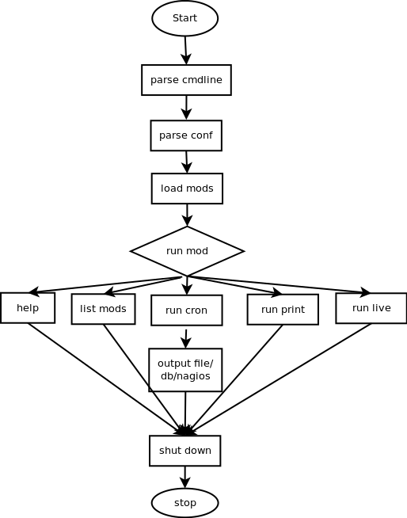

## Tsar
Tsar是淘宝的一个用来收集服务器系统和应用信息的采集报告工具

git: https://github.com/alibaba/tsar

#### 总体架构
* Tsar是基于模块化设计的程序，程序有两部分组成：框架和模块。
* 框架程序源代码主要在src目录，而模块源代码主要在modules目录中。
* 框架提供对配置文件的解析，模块的加载，命令行参数的解析，应用模块的接口对模块原始数据的解析与输出。 模块提供接口给框架调用。
* Tsar依赖与cron每分钟执行采集数据，因此它需要系统安装并启用crond，安装后，tsar每分钟会执行tsar --cron来定时采集信息，并且记录到原始日志文件。


#### Tsar的运行流程图


* 解析输入
    * 根据用户的输入，初始化一些全局信息，如间隔时间，是否merge，是否指定模块，运行模式

* 读取配置文件信息
    * 主要解析tsar的配置文件，如果include生效，则会解析include的配置文件
    * 配置文件用来获得tsar需要加载的模块，输出方式，每一类输出方式包含的模块，和此输出方式的接收信息
    * 如mod_cpu on代表采集cpu的信息
    * output_interface file,nagios表示向文件和nagios服务器发送采集信息和报警信息

* 加载相应模块
    * 根据配置文件的模块开启关闭情况，将模块的动态库load到系统

* tsar的三种运行模式
    * tsar在运行的时候有三种模式：
    * print模式仅仅输出指定的模块信息，默认显示最近一天的；
    * live模式是输出当前信息，可以精确到秒级
    * cron模式，此一般是crontab定时执行，每一分钟采集一次所有配置的模块信息，并将数据写入原始文件，在cron运行的时候 会判断是否配置输出到db或者nagios，如果配置则将相应格式的数据输出到对应接口。

* 释放资源
    * 程序最后，释放动态库，程序结束

#### Tsar 指令介绍
```bash
$ tsar -h
Usage: tsar [options]
Options:
    -check         查看最后一次的采集数据
    --check/-C     查看最后一次tsar的提醒信息，如：tsar --check / tsar --check --cpu --io
    --cron/-c      使用crond模式来进行tsar监控
    --interval/-i  指明tsar的间隔时间，默认单位分钟,默认显示间隔5分钟；带上--live参数则单位是秒，默认是5秒。 
    --list/-L      列出启用的模块
    --live/-l      启用实时模式，类似iostat等，可以配合-i参数和模块参数使用。
    --file/-f      指定输入文件
    --ndays/-n     控制显示多长时间的历史数据，默认1天
    --date/-d      指定日期,YYYYMMDD或者n代表n天前
    --detail/-D    能够指定查看主要字段还是模块的所有字段
    --spec/-s      指定字段,tsar -cpu -s sys,util
    --watch/-w     显示最后多少分钟的记录. 如:tsar --watch 30 / tsar --watch 30 --cpu --io
    --merge/-m     对有多个数据的展示，进行汇总，如机器上跑了3个squid，可以用 tsar -squid -m的放式进行展示汇总。
    --item/-I      显示指定项目数据, 如:tsar --io -I sda
    --help/-h      显示提示信息和模块信息

Modules Enabled:
    --cpu          列出cpu相关的监控计数
    --mem          物理内存的使用情况
    --swap         虚拟内存的使用情况
    --tcp          TCP协议IPV4的使用情况
    --udp          UDP协议IPV4的使用情况
    --traffic      网络传出的使用情况
    --io           Linux IO的情况
    --pcsw         进程和上下文切换
    --partition    磁盘使用情况
    --tcpx         TCP连接相关的数据参数
    --load         系统负载情况
```

#### tsar指标解释
* cpu
    * 采样文件`/proc/stat`
    * user: 表示CPU执行用户进程的时间,通常期望用户空间CPU越高越好.
    * sys: 表示CPU在内核运行时间,系统CPU占用率高,表明系统某部分存在瓶颈.通常值越低越好.
    * wait: CPU在等待I/O操作完成所花费的时间.系统部应该花费大量时间来等待I/O操作,否则就说明I/O存在瓶颈.
    * hirq: 系统处理硬中断所花费的时间百分比
    * sirq: 系统处理软中断所花费的时间百分比
    * util: CPU总使用的时间百分比
        * cpu 时间
        ```bash
            User time
            Nice time
            System time
            Idle time
            Waiting time
            Hard Irq time
            SoftIRQ time
            Steal time
        ```
        * util = 1 - idle - iowait - steal
    * nice: 系统调整进程优先级所花费的时间百分比
    * steal: 被强制等待（involuntary wait）虚拟CPU的时间,此时hypervisor在为另一个虚拟处理器服务
    * ncpu: CPU的总个数

* mem
    * 采样文件`/proc/meminfo`
    * free: 空闲的物理内存的大小
    * used: 已经使用的内存大小
    * buff: buff使用的内存大小,buffer is something that has yet to be "written" to disk.
    * cach: 操作系统会把经常访问的东西放在cache中加快执行速度,A cache is something that has been "read" from the disk and stored for later use
    * total: 系统总的内存大小
    * util: 内存使用率
        * men 
        ```bash
            MemTotal
            MemFree
            Buffers
            Cached
        ```
        * util = (total - free - buff - cache) / total * 100%

* load
    * 采样文件`/proc/loadavg`
    * load1: 一分钟的系统平均负载
    * load5: 五分钟的系统平均负载
    * load15:十五分钟的系统平均负载
    * runq: 在采样时刻,运行队列的任务的数目,与/proc/stat的procs_running表示相同意思
    * plit: 在采样时刻,系统中活跃的任务的个数（不包括运行已经结束的任务）

* traffic
    * 采样文件`/proc/net/dev`
    * bytin: 入口流量byte/s
    * bytout: 出口流量byte/s
    * pktin: 入口pkt/s
    * pktout: 出口pkt/s    

* tcp
    * 采样文件`/proc/net/snmp`
    * active:主动打开的tcp连接数目
    * pasive:被动打开的tcp连接数目
    * iseg: 收到的tcp报文数目
    * outseg:发出的tcp报文数目
    * EstRes:在 ESTABLISHED 状态下发生的重置次数 Number of resets that have occurred at ESTABLISHED
    * AtmpFa:失败的连接尝试次数 Number of failed connection attempts
    * CurrEs:当前状态为ESTABLISHED的tcp连接数
    * retran:系统的重传率

* udp
    * 采样文件`/proc/net/snmp`
    * idgm: 收到的udp报文数目
    * odgm: 发送的udp报文数目
    * noport:udp协议层接收到目的地址或目的端口不存在的数据包
    * idmerr:udp层接收到的无效数据包的个数

* io
    * 采样文件`/proc/diskstats`
    * rrqms: 每秒向设备发出的合并读取请求数 The number of read requests merged per second that were issued to the device.
    * wrqms: 每秒向设备发出的合并写入请求数 The number of write requests merged per second that were issued to the device.
    * rs: 每秒向设备发出的读取请求数 The number of read requests that were issued to the device per second.
    * ws: 每秒向设备发出的写入请求数 The number of write requests that were issued to the device per second.
    * rsecs: 每秒从设备读取的扇区数 The number of sectors read from the device per second.
    * wsecs: 每秒写入设备的扇区数 The number of sectors written to the device per second.
    * rqsize: 向设备发出的请求的平均大小（以扇区为单位） The average size (in sectors) of the requests that were issued to the device.
    * qusize: 向设备发出的请求的平均队列长度 The average queue length of the requests that were issued to the device.
    * await: 向要服务的设备发出 I/O 请求的平均时间（以毫秒为单位）。这包括队列中的请求所花费的时间以及为它们提供服务所花费的时间 The average time (in milliseconds) for I/O requests issued to the device to be served. This includes the time spent by the requests in queue and the time spent servicing them.
    * svctm: 向设备发出的 I/O 请求的平均服务时间（以毫秒为单位） The average service time (in milliseconds) for I/O requests that were issued to the device.
    * util: 向设备发出 I/O 请求的 CPU 时间百分比（设备的带宽利用率）。当此值接近 100% 时，设备饱和 Percentage of CPU time during which I/O requests were issued to the device (bandwidth utilization for the device).Device saturation occurs when this value is close to 100%.

* paritition
    * 首先通过`/etc/mtab`获取到分区信息,然后通过statfs访问该分区的信息,查询文件系统相关信息
        ```bash
            struct statfs {
            long f_type; /* 文件系统类型 */
            long f_bsiz
            e; /* 经过优化的传输块大小 */
            long f_blocks; /* 文件系统数据块总数 */
            long f_bfree; /* 可用块数 */
            long f_bavail; /* 非超级用户可获取的块数 */
            long f_files; /* 文件结点总数 */
            long f_ffree; /* 可用文件结点数 */
            fsid_t f_fsid; /* 文件系统标识 */
            long f_namelen; /* 文件名的最大长度 */
            };
        ```
    * bfree: 分区空闲的字节
    * bused: 分区使用中的字节
    * btotl: 分区总的大小
    * util: 分区使用率

* pcsw
    * 采样文件`/proc/stat`
    * cswch: 进程切换次数
    * proc: 新建的进程数

* proc
    * 采样文件
        * `/proc/pid/stat`:获取进程的cpu信息
        * `/proc/pid/status`:获取进程的mem信息
        * `/proc/pid/io`:获取进程的读写IO信息
    * user: 某个进程用户态cpu消耗
    * sys: 某个进程系统态cpu消耗
    * total:某个进程总的cpu消耗
    * mem: 某个进程的内存消耗百分比
    * RSS: 某个进程的虚拟内存消耗,这是驻留在物理内存的一部分.它没有交换到硬盘.它包括代码,数据和栈
    * read: 进程io读字节
    * write:进程的io写字节
    需要将采集的进程名称配置在/etc/tsar/tsar.conf 总的 mod_proc on procname, 这样就会找到procname的pid, 并进行数据采集
    ```bash
        ####[module]
        mod_proc on dockerd
    ```
    查找进程名称：
    ```bash
        1. 通过 ps 找到对应的pid
        2. cat /proc/pid/status
        Name:   dockerd
        Umask:  0022
        State:  S (sleeping)
        Tgid:   7877
        Ngid:   0
        Pid:    7877

        name 便是进程名称
    ```

* nginx
    * 采集方法：通过nginx的采集模块配置,访问特定地址,具体参见:https://github.com/taobao/tsar-mod_nginx
    * Accept:总共接收的新连接数目
    * Handle:总共处理的连接数目
    * Reqs:总共产生请求数目
    * Active:活跃的连接数,等于read+write+wait
    * Read:读取请求数据的连接数目
    * Write:向用户写响应数据的连接数目
    * Wait:长连接等待的连接数目
    * Qps:每秒处理的请求数
    * Rt:平均响应时间ms